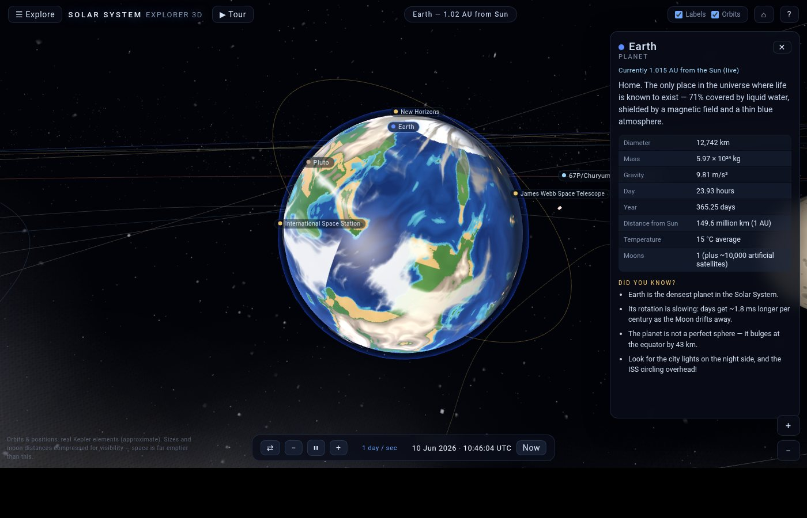
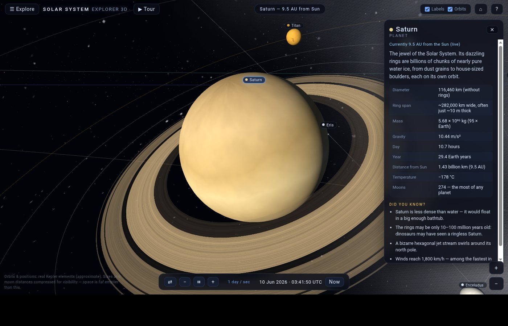
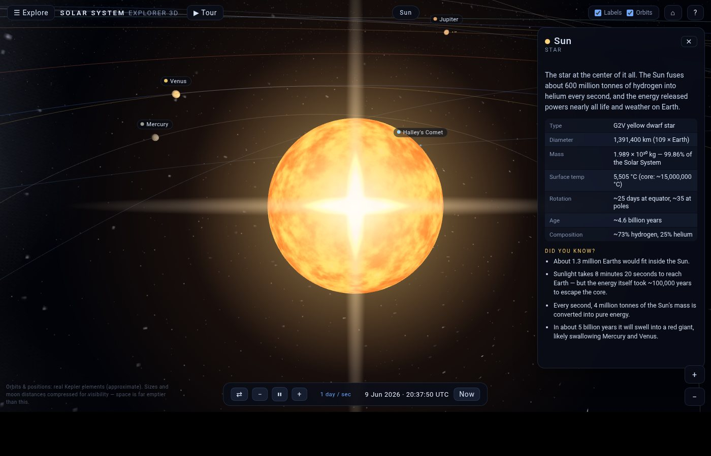
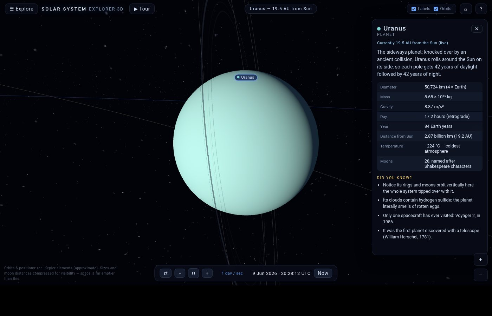
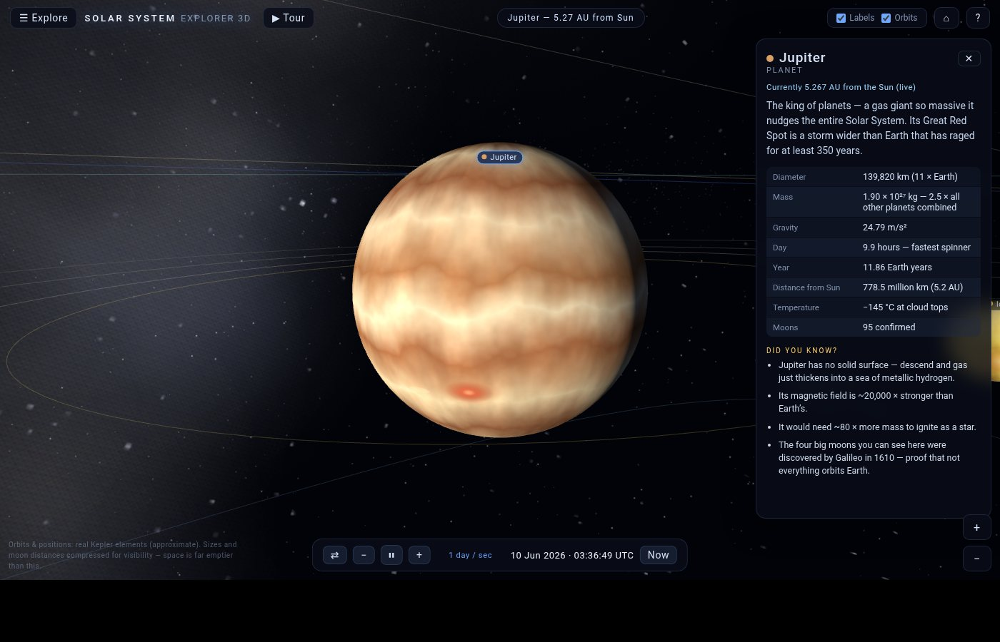
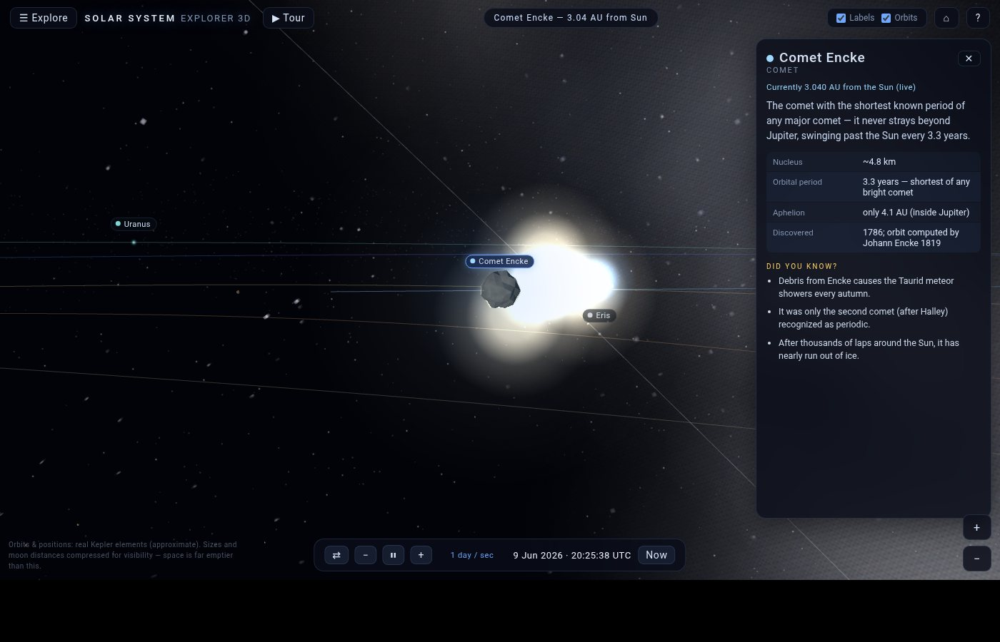
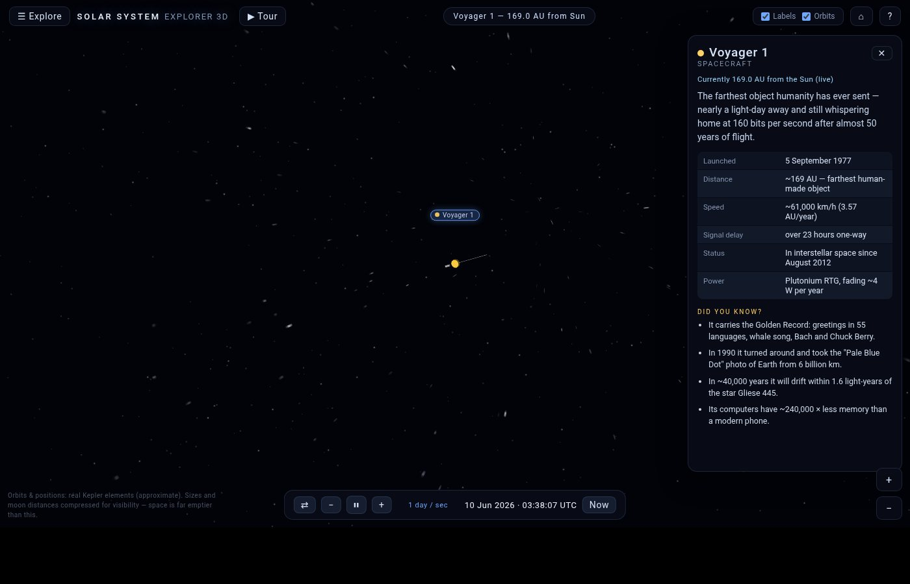

# 🪐 Solar System Explorer 3D

An interactive 3D solar system that runs entirely in your browser — no install,
no build step, no internet required. Travel between planets, land your camera at
their moons, chase comets through time, and visit the ISS and the Voyagers.

**▶ Live demo: https://auwracode.github.io/Solar-System-3D/**



| | |
| --- | --- |
|  |  |
|  |  |
|  |  |

## Run it locally

**Just double-click `index.html`.** It works straight from disk — three.js is
vendored in `js/vendor/` and every texture is generated procedurally at load
time, so the app has zero network dependencies.

If your browser ever complains, serve it instead:

```bash
git clone https://github.com/AuwraCode/Solar-System-3D.git
cd Solar-System-3D
python3 -m http.server 8000
# open http://localhost:8000
```

Deep links work too: `index.html#saturn`, `#iss`, `#voyager1`, `#halley`, …

## What's inside

- **The Sun** — animated plasma-shader surface, corona and flares
- **All 8 planets** with procedurally generated textures: Earth has day/night
  city lights, drifting clouds and an atmosphere; Jupiter has its Great Red
  Spot; Saturn and Uranus have rings — and Uranus' whole system stands
  sideways, just like in reality; Venus spins backwards
- **3 dwarf planets** — Pluto (with its nitrogen-ice heart), Ceres, Eris
- **16 moons** — the Galilean four, Titan, Enceladus, Triton, lumpy little
  Phobos & Deimos, and more
- **3 comets** — Halley, 67P/Churyumov–Gerasimenko and Encke, with dynamic
  ion + dust particle tails that grow as they approach the Sun
- **5 spacecraft** — the ISS circling Earth as a tiny 3D model, JWST at the
  L2 point, and Voyager 1, Voyager 2 & New Horizons on their real outbound
  headings with live distance readouts
- **Asteroid belt** (2,300 tumbling instanced rocks), the **Kuiper Belt**,
  a Milky Way panorama and ~6,000 stars

Every object is clickable and opens a fact sheet with real data and
"did you know?" trivia. A **▶ Tour** button flies you through the highlights.

## Controls

| Input | Action |
| --- | --- |
| Click object / label | Travel to it + open its fact sheet |
| Drag | Orbit the current target |
| Scroll / pinch | Zoom — all the way down to the surface |
| Double-click | Dive closer |
| `Esc` | Back to the full-system view |
| `0–9` | Sun & planets shortcuts (9 = Pluto) |
| `F` | Free-flight mode (`WASD` + `Q/E`, `Shift` boost, drag to look) |
| `Space` · `,` · `.` | Pause / slower / faster time |
| `⇄` | Run time backwards |
| `T` | Grand tour autopilot |
| `L` / `O` | Toggle labels / orbit lines |
| ☰ Explore | Searchable index of every object |

## Time machine

Positions are computed from each body's real Keplerian orbital elements
(J2000 epoch), so the planetary arrangement matches the simulated date.
Rewind to **February 1986** or fast-forward to **July 2061** and watch
Halley's Comet dive past the Sun and grow its tail. The ISS is best enjoyed
at *Real time* or *1 min/s*.

## Accuracy notes

- Heliocentric **distances and orbital positions are to scale** (1 AU = 60
  units) and follow real elements — eccentricities, inclinations, Pluto's
  17° tilt, Halley's retrograde path.
- **Body sizes are compressed** (square-root scale) and **moon orbits are
  enlarged** — at true scale every planet would be smaller than a pixel.
- Deep-space probe positions follow their real direction and recession
  speed, approximately.

## Tech

Hand-written vanilla JavaScript (~3,900 lines) + [three.js r147](https://threejs.org)
(vendored, MIT license).

- **Zero image assets** — every planet surface, the rings, the Milky Way and
  all sprites are painted at load time with seeded value-noise/fBm on
  `<canvas>`
- Real Kepler solver (Newton's method) for planets, dwarfs and comets
- Custom GLSL shaders for the Sun, Earth's day/night terminator and
  atmospheric rim glows
- Instanced asteroid belt, particle comet tails, decluttered HTML labels
- No frameworks, no bundler — open the file and it runs
